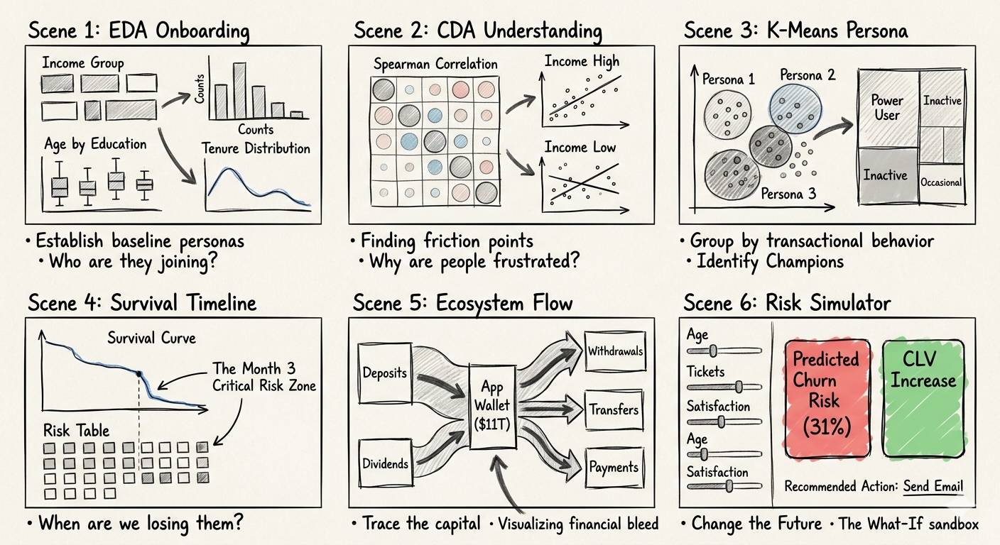
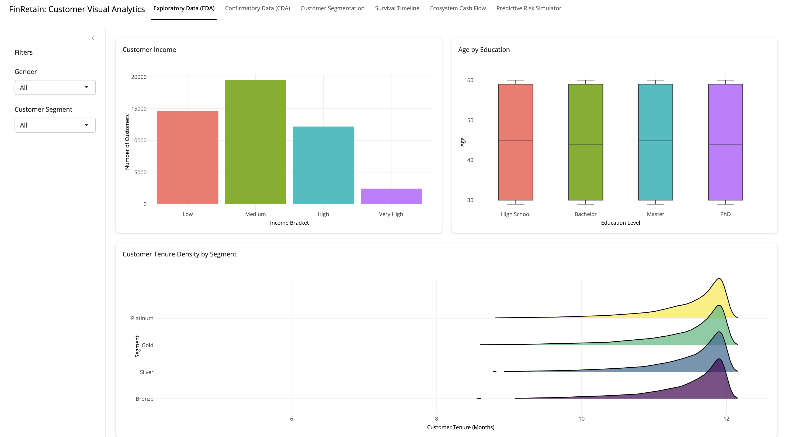
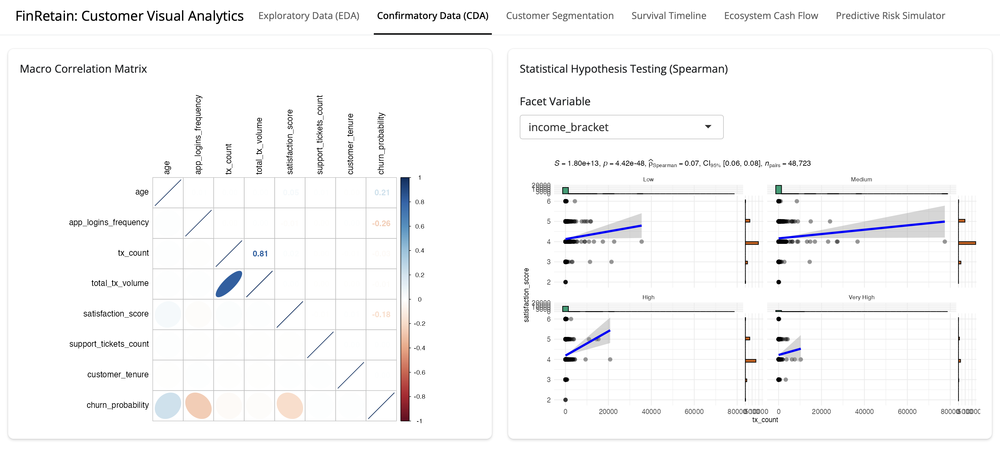
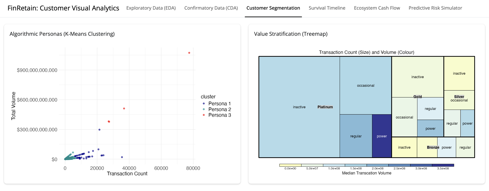
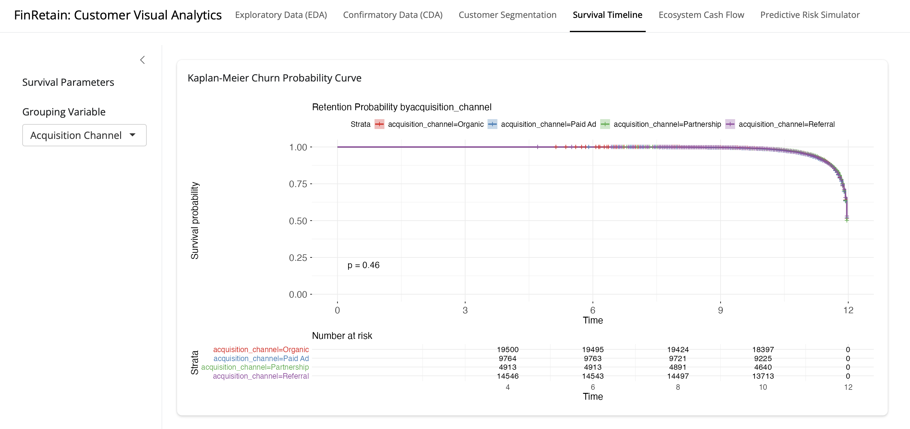
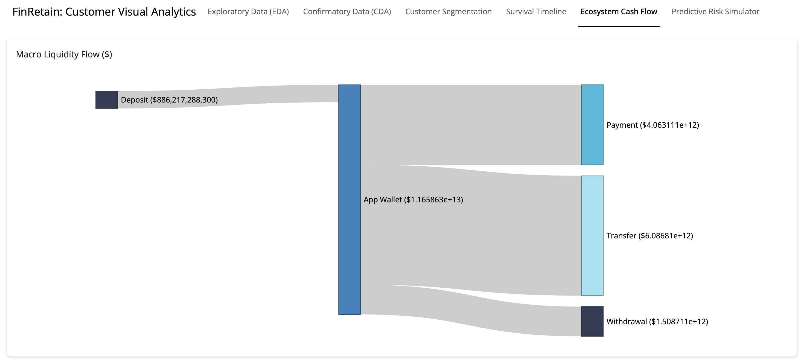
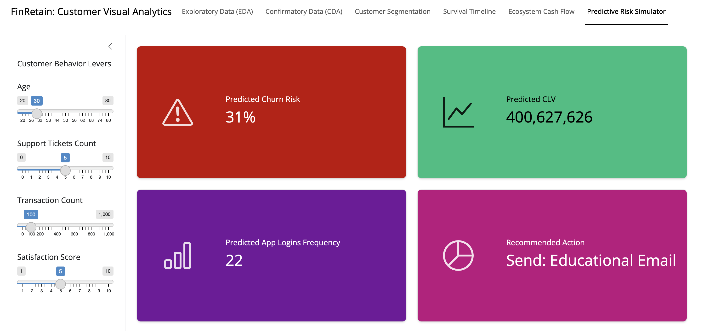

Link to Shiny App: <https://zuosuhui.shinyapps.io/take-home_ex02/>

# 1. Background

In the highly competitive financial technology (FinTech) and banking sector, customer retention is a critical driver of profitability. Acquiring a new customer is significantly more expensive than retaining an existing one. However, identifying exactly when and why a customer might abandon a financial platform (churn) remains a complex challenge due to the high-dimensional nature of transactional data. FinRetain is designed to address this critical blind spot. It is an interactive visual analytics platform built to help financial analysts and product stakeholders dynamically explore customer demographics, track behavioral friction points, and proactively predict churn using advanced statistical modeling. Rather than analyzing isolated metrics, FinRetain presents a comprehensive view of the customer lifecycle. This approach allows analysts and decision-makers to understand patterns across different stages of user engagement and generate actionable insights.

## 1.1 Objectives

FinRetain aims to shift the process from reactive reporting to proactive and predictive visual analytics. Specifically, the platform is designed to address three key questions:

1.  Who are the most valuable users on the platform?

2.  How does money flow within the financial ecosystem?

3.  When and why are users likely to leave?

By answering these questions, stakeholders can take earlier and more informed actions to improve customer retention.

## 1.2 The Dataset

The dataset powering FinRetain contains historical records of customer accounts and transactional logs, encompassing:

-   **Demographics:** Age, Gender, Education Level, Income Bracket.

-   **Engagement Metrics:** App Logins, Support Tickets Logged, Satisfaction Score (1-5).

-   **Transactional Data:** Transaction counts, average transaction values, and aggregated volumes across various types (Deposits, Payments, Transfers, Withdrawals).

-   **Target Variables:** Customer Tenure (months), Churn Probability, and Customer Lifetime Value (CLV).

# 2. Methodology

To construct this analytical narrative, the project follows a structured pipeline that progresses from descriptive insights to predictive modeling.

**Phase 1: Foundation (UI Design)**\
This phase involves designing an interface that minimizes cognitive load and enhances usability.

**Phase 2: Discovery (Exploratory and Confirmatory Data Analysis)**\
EDA and CDA are used to establish baseline demographic characteristics and test hypotheses regarding customer behavior.

**Phase 3: Segmentation (Cluster Analysis)**\
K-Means clustering is applied to automatically group users based on behavioral and transactional patterns.

**Phase 4: Ecosystem Mapping**\
A Sankey diagram is used to visualize macro-level financial flows and identify key liquidity pathways within the system.

**Phase 5: Forecasting (Predictive Modeling)**\
Regression-based predictive models estimate churn risk, customer lifetime value (CLV), and app logins frequency, providing recommended action to decision-makers.

# 3. Storyboard: The FinRetain Narrative

Data without meaningful interpretation often becomes noise rather than insight. The FinRetain storyboard illustrates the full lifecycle of a FinTech customer, from their initial engagement with the platform to the potential risk of churn. Through this narrative structure, our storyboard demonstrates how stakeholders can identify critical behavioral patterns and intervene at the right moments.

## 3.1 Storyboard Design

This storyboard represents the conceptual blueprint for **FinRetain**, an end-to-end visual analytics solution designed for the FinTech sector.



## 3.2 Scene 1: Onboarding and Demographic Baseline (EDA)

**Visualization:** Distribution plots, bar charts, and ridge plots.

The journey begins when a customer joins the platform. The Exploratory Data Analysis page provides an overview of the demographic structure of the user base, including variables such as age, education level, income group, and tenure distribution across CLV segments. By visualizing these distributions, analysts can identify demographic patterns. These insights help guide product targeting and marketing strategies.

## 3.3 Scene 2: Understanding Behavioral Relationships (CDA)

**Visualization:** Correlation matrices and statistical plots.

After establishing demographic patterns, the Confirmatory Data Analysis page explores relationships between behavioral variables. A correlation matrix allows analysts to quickly identify strong relationships among key indicators such as transaction frequency, transaction volume, and customer satisfaction. Additional statistical views break down these relationships across income groups, helping stakeholders determine whether behavioral patterns remain consistent across different customer segments.

## 3.4 Scene 3: Identifying Customer Personas (Customer Segmentation)

**Visualization:** K-Means cluster scatter plot and value stratification treemap.

As customers continue to interact with the platform, their behavioral patterns become clearer. In this stage, FinRetain applies K-Means clustering to group customers based on similarities in their transactional behavior.

The scatter plot on the left visualizes the clustering results using two key behavioral indicators: transaction count and total transaction volume. Each point represents a customer, while colors distinguish different algorithmically generated personas (Persona 1, Persona 2, and Persona 3). This visualization allows analysts to observe how customers naturally group according to their activity levels. For example, a small number of users appear in the upper-right region of the plot, indicating extremely high transaction frequency and volume, representing highly active users.

To complement this behavioral view, the treemap on the right provides a value-based perspective of the customer ecosystem. The size of each block represents median transaction count, while the color intensity reflects median transaction volume. Customers are further categorized into segments such as inactive, occasional, regular, and power users within broader CLV segments such as Platinum, Gold, Silver, and Bronze.

## 3.5 Scene 4: The Ticking Clock of Retention (Survival Timeline)

**Visualization:** Kaplan-Meier survival curves and risk tables. As the customer journey progresses, the focus shifts from current behavior to future longevity. The Survival Timeline acts as a visual "ticking clock," mapping the probability that a customer will remain active over 12 months. By stratifying these curves by Acquisition Channel, Income Bracket, or Customer Segmentation, stakeholders can identify precisely when the phase ends for different cohorts.

## 3.6 Scene 5: Mapping the Financial Ecosystem (Ecosystem Cash Flow)

**Visualization:** Macro Liquidity Flow (Sankey Diagram).

Zooming out from the individual user to the entire platform, we visualize the financial ecosystem of the company’s capital. The Sankey Diagram traces the movement of trillions of dollars in real-time. It begins with the source, i.e., Deposits, flowing into the central App Wallet, and then branching out to Payments, Transfers, and Withdrawals. The width of each flow line provides an immediate proportional understanding of the ecosystem's health.

## 3.7 Scene 6: Simulating the Future (Predictive Risk Simulator)

**Visualization:** Interactive slider inputs and value cards.

The Predictive Risk Simulator allows stakeholders to step into the role of a strategist, manipulating behavioral levers such as Age, Support Ticket Count, Transaction Count, and Satisfaction Score to see how they impact a hypothetical customer’s future. As the user adjusts a slider, the Predicted Churn Risk, Predicted CLV, and Predicted App Logins Frequency update in real-time. Finally, the UI provides a prescriptive conclusion in the right bottom card, suggesting a specific Recommended Action, such as "Send: Educational Email," effectively turning visual data into a direct marching order for the decision-makers.

# 4. UI Design

The FinRetain dashboard is designed to transform complex financial data into intuitive, actionable insights. To achieve this, our User Interface (UI) architecture strictly follows the principles of reducing cognitive load and maximizing interactivity. The application is divided into a consistent global shell and modular workspaces.

## 4.1 Page 1: Exploratory Data (EDA)

The EDA workspace is designed to provide a high-level demographic pulse of the customer base.

-   **Segmented Layout:** By utilizing a 2x2 grid, the UI allows for simultaneous comparison of categorical data (Income), continuous data (Age by Education), and density distributions (Tenure by Segment).

-   **Information Density:** We use "Ridge Plots" for Customer Tenure to show overlapping density across four segments (Platinum to Bronze) in a single vertical space, minimizing the need for multiple separate charts.

-   **Interactive Discovery:** Tooltips are configured to reveal exact values only upon hovering, keeping the initial visual clean and focused on macro trends.



## 4.2 Page 2: Confirmatory Data (CDA)

The CDA page shifts from what the data is to why variables correlate, focusing on statistical validation.

-   **Macro Correlation Matrix:** We use a half-matrix design to eliminate redundant data. The use of color-coded ellipses (Blue for positive, Red for negative) allows a researcher to spot strong relationships (like the **0.81 correlation** between Transaction Count and Volume) at a glance.

-   **Statistical Faceting:** The right-hand panel utilizes faceting to break down Spearman hypothesis testing by income bracket or education level. This allows the user to see if the relationship between satisfaction and transaction count remains consistent across different wealth tiers or education levels.



## 4.3 Page 3: Customer Segmentation

This page translates unsupervised machine learning (K-Means) into a business-readable format.

-   **Dual-Perspective Analysis:** The UI places a Scatter Plot (behavioral clusters) next to a Treemap (value stratification). This forces a connection between how a customer acts and what they are worth to the ecosystem.

-   **Color-Coded Personas:** We use a distinct qualitative color palette for Personas 1, 2, and 3 to ensure that Power Users are visually separated from Inactive or Occasional users across both charts.



## 4.4 Page 4: Survival Timeline

The Survival Timeline is built to track the pulse of customer retention over a 12-month cycle.

-   **The Kaplan-Meier Interface:** The UI focuses on a single, high-impact line graph with At-risk table positioned directly below the X-axis. This alignment ensures the user can correlate the drop-off in the curve with the raw number of customers remaining in the cohort.

-   **Channel Stratification:** A simple grouping variable dropdown allows for instant re-calculation of the curve by Acquisition Channel, Income Bracket, or Customer Segment, making it easy to identify which marketing segments have the highest longevity.



## 4.5 Page 5: Ecosystem Cash Flow

This module utilizes a Sankey Diagram to map the movement of trillions of dollars through the platform.

-   **Linear Flow Logic:** The UI follows a strict left-to-right source-to-sink logic. Money enters via deposits, pools in the App Wallet, and distributes into payments, transfers, and withdrawals.

-   **Scale Recognition:** The width of the flows provides an immediate proportional understanding of where the most capital is exiting the system.



## 4.6 Page 6: Predictive Risk Simulator

The final page is a low-code interface for high-level decision-making, turning a regression model into a tactile experience.

-   **Input/Output Loop:** The UI is split into sliders on the left and large color-blocked cards on the right.

-   **Prescriptive Design:** We don't just show a number. Instead, we also provide a recommended action, which moves beyond analysis into direct business intervention.



# 5. Technical Implementation

## **5.1 Getting started**

### **5.1.1 Installing and loading the required libraries**

Before starting the analysis, the required R packages are installed and loaded into the R environment.

```{R}
pacman::p_load(shiny, tidyverse, plotly, bslib, ggridges, corrplot, ggstatsplot, treemap, survival, survminer, networkD3)
```

### **5.1.2 Importing data**

The code chunk below imports *customer_data.csv* and *transactions_data.csv* into R environment by using [*read_csv()*](https://readr.tidyverse.org/reference/read_delim.html)function of [**readr**](https://readr.tidyverse.org/) package.

```{R}
customer <- read.csv("data/customer_data.csv")
transactions <- read.csv("data/transactions_data.csv")
```

## 5.2 Exploratory Data (EDA)

Data preparation

```{R}
plot_data <- customer

input <- data.frame(gender_filter = "All",
                    segment_filter = "All") # User input

if (input$gender_filter != "All") {
  plot_data <- plot_data %>% 
    filter(gender == input$gender_filter)
}

if (input$segment_filter != "All") {
  plot_data <- plot_data %>% 
    filter(customer_segment == input$segment_filter)
}

plot_data$income_bracket <- factor(plot_data$income_bracket,
                                   levels = c("Low",
                                              "Medium",
                                              "High",
                                              "Very High"))

plot_data$education_level <- factor(plot_data$education_level,
                                    levels = c("High School",
                                               "Bachelor",
                                               "Master",
                                               "PhD"))

plot_data$clv_segment <- factor(plot_data$clv_segment,
                                levels = c("Bronze",
                                           "Silver",
                                           "Gold",
                                           "Platinum"))
```

Customer Income

```{R}
p <- ggplot(plot_data,
            aes(x = income_bracket,
                fill = income_bracket)) +
  geom_bar() +
  labs(x = "Income Bracket",
       y = "Number of Customers") +
  theme_minimal() +
  theme(axis.title = element_text(size = 10),
        axis.text = element_text(size = 10),
        plot.title = element_text(size = 15),
        legend.position = "none")
ggplotly(p)
```

Age by Education

```{R}
p <- ggplot(plot_data, aes(x = education_level,
                           y = age,
                           fill = education_level)) +
  geom_boxplot() +
  labs(x = "Education Level",
       y = "Age") +
  theme_minimal() +
  theme(axis.title = element_text(size = 10),
        axis.text = element_text(size = 10),
        plot.title = element_text(size = 15),
        legend.position = "none")
ggplotly(p)
```

Customer Tenure Density by Segment

```{R}
p <- ggplot(plot_data,
            aes(x = customer_tenure,
                y = clv_segment,
                fill = clv_segment)) +
  geom_density_ridges(alpha = 0.7,
                      scale = 1.5,
                      rel_min_height = 0.01) +
  scale_fill_viridis_d(option = "D",
                       guide = "none") +
  labs(x = "Customer Tenure (Months)",
       y = "Segment") +
  theme_minimal() +
  theme(axis.title = element_text(size = 10),
        axis.text = element_text(size = 10),
        plot.title = element_text(size = 15),
        legend.position = "none")
ggplotly(p)
```

## 5.3 Confirmatory Data (CDA)

### 5.3.1 Macro Correlation Matrix

Data Preparation

```{R}
plot_data <- customer %>%
  select(age,
         app_logins_frequency,
         tx_count,
         total_tx_volume,
         satisfaction_score,
         support_tickets_count,
         customer_tenure,
         churn_probability)

customer.cor <- cor(plot_data)
```

Correlation plot

```{R}
corrplot.mixed(customer.cor,
               lower = "ellipse",
               upper = "number",
               tl.pos = "lt",
               diag = "l",
               tl.col = "black")
```

### 5.3.2 Statistical Hypothesis Testing (Spearman)

Data Preparation

```{R}
plot_data <- customer
    
plot_data$income_bracket <- factor(plot_data$income_bracket,
                                   levels = c("Low",
                                              "Medium",
                                              "High",
                                              "Very High"))

plot_data$education_level <- factor(plot_data$education_level,
                                    levels = c("High School",
                                               "Bachelor",
                                               "Master",
                                               "PhD"))
```

Correlation Plot (Faced By Income Bracket)

```{R}
input <- data.frame(facet_var_filter = "income_bracket")

ggscatterstats(data = plot_data,
               x = tx_count,
               y = satisfaction_score,
               type = "nonparametric") +
  facet_wrap(input$facet_var_filter) +
  theme_minimal() +
  theme(axis.title = element_text(size = 10),
        axis.text = element_text(size = 10))
```

Correlation Plot (Faced By Education Level)

```{R}
input <- data.frame(facet_var_filter = "education_level")

ggscatterstats(data = plot_data,
               x = tx_count,
               y = satisfaction_score,
               type = "nonparametric") +
  facet_wrap(input$facet_var_filter) +
  theme_minimal() +
  theme(axis.title = element_text(size = 10),
        axis.text = element_text(size = 10))
```

## 5.4 Customer Segmentation

### 5.4.1 Algorithmic Personas (K-Means Clustering)

Data Preparation

```{R}
cluster_data <- customer %>%
  select(tx_count, total_tx_volume)

kmeans_result <- kmeans(scale(cluster_data), centers = 3)

cluster_data$cluster <- paste("Persona", kmeans_result$cluster)
```

Scatter Plot

```{R}
ggplot(cluster_data, aes(x = tx_count, y = total_tx_volume, color = cluster)) +
  geom_point(alpha = 0.6, size = 2) +
  scale_color_manual(values = c("Darkblue", "Darkcyan", "Red")) +
  scale_y_continuous(labels = scales::dollar_format()) +
  theme_minimal() +
  labs(x = "Transaction Count",
       y = "Total Volume") +
  theme_minimal() +
  theme(axis.title = element_text(size = 15),
        axis.text = element_text(size = 15),
        legend.text = element_text(size = 15),
        legend.title = element_text(size = 15))
```

### 5.4.2 Value Stratification (Treemap)

Data Preparation

```{R}
plot_data <- customer %>%
  group_by(customer_segment, clv_segment) %>%
  summarise(median_tx_count = median(tx_count),
            median_tx_volume = median(total_tx_volume))
```

Treemap Plot

```{R}
treemap(plot_data,
        index=c("clv_segment", "customer_segment"),
        vSize="median_tx_count",
        vColor="median_tx_volume",
        type="value",
        palette="RdYlBu",
        title="Transaction Count (Size) and Volume (Colour)",
        title.legend = "Median Transcation Volume"
)
```

## 5.5 Survival Timeline

Data Preparation

```{R}
plot_data <- customer %>%
  mutate(is_churned = ifelse(customer_segment == "inactive" | churn_probability > 0.8, 1, 0))

km_fit <- survfit(Surv(customer_tenure, is_churned) ~ acquisition_channel, data = plot_data)
```

Kaplan-Meier Churn Probability Curve

```{R}
p <- ggsurvplot(km_fit,
           data = plot_data,
           risk.table = TRUE,
           pval = TRUE,
           conf.int = TRUE,
           palette = "Set1",
           xlim = c(0, 12),
           title = paste0("Retention Probability by Acquisition Channel"),
           legend.title = "Strata",
           ggtheme = theme_minimal())

p$plot <- p$plot +
  theme(axis.title = element_text(size = 15),
        axis.text = element_text(size = 15),
        plot.title = element_text(size = 15),
        legend.text = element_text(size = 12),
        legend.title = element_text(size = 12))

p$table <- p$table + 
  theme(axis.title = element_text(size = 15),
        axis.text = element_text(size = 12),
        plot.title = element_text(size = 15))

p
```

## 5.6 Ecosystem Cashflow

Data Preparation

```{R}
tx_summary <- transactions %>%
  group_by(type) %>%
  summarise(total_volume = sum(amount, na.rm = TRUE))

links <- data.frame(source = c("Deposit", "App Wallet", "App Wallet", "App Wallet"),
                    target = c("App Wallet", "Payment", "Transfer", "Withdrawal"),
                    type = c("Deposit", "Payment", "Transfer", "Withdrawal")) %>%
  left_join(tx_summary, by = "type") %>%
  rename(value = total_volume)

node_totals <- data.frame(name = unique(c(links$source, links$target))) %>%
  rowwise() %>%
  mutate(total = max(sum(links$value[links$source == name]), sum(links$value[links$target == name])),
         label = paste0(name, " ($", format(round(total, 0), big.mark = ","), ")"))

links$IDsource <- match(links$source, node_totals$name) - 1
links$IDtarget <- match(links$target, node_totals$name) - 1
```

Sankey Diagram

```{R}
sankeyNetwork(Links = links, Nodes = node_totals, Source = "IDsource", Target = "IDtarget",
              Value = "value", NodeID = "label", fontSize = 14, nodeWidth = 40, 
              nodePadding = 20, sinksRight = FALSE, 
              colourScale = JS("d3.scaleOrdinal().range(['#1c2541', '#0077b6', '#00b4d8', '#90e0ef']);"))
```

## 5.7 Predictive Risk Simulator

Data Preparation

```{R}
pred_churn <- lm(churn_probability ~ age + support_tickets_count + tx_count + satisfaction_score, data = customer)
pred_clv <- lm(customer_lifetime_value ~ age + support_tickets_count + tx_count + satisfaction_score, data = customer)
pred_login <- lm(app_logins_frequency ~ age + support_tickets_count + tx_count + satisfaction_score, data = customer)

input <- data.frame(age_slider = 30,
                    tx_slider = 100,
                    support_slider = 5,
                    sat_slider = 5) # User input

newdata <- data.frame(age = input$age_slider,
                          tx_count = input$tx_slider,
                          support_tickets_count = input$support_slider,
                          satisfaction_score = input$sat_slider)

```

Prediction of Churn Risk

```{R}
res <- predict(pred_churn, newdata = newdata)

scales::percent(max(0, min(1, res)))
```

Prediction of CLV

```{R}
res <- predict(pred_clv, newdata = newdata)
    
format(round(res, 0), big.mark = ",")
```

Prediction of App Logins Frequency

```{R}
res <- predict(pred_login, newdata = newdata)
    
format(round(res, 0), big.mark = ",")
```

Recommended Action Based On Prediction

```{R}
risk <- predict(pred_churn, newdata = newdata)
sat <- newdata$satisfaction_score

action <- case_when(
  risk > 0.6 & sat < 5 ~ "Priority: Manager Call",
  risk > 0.6 & sat >= 5 ~ "Offer: Loyalty Discount",
  risk <= 0.6 & risk > 0.3 ~ "Send: Educational Email",
  TRUE ~ "Status: Healthy (Monitor)")
  
action
```

# 6. Conclusion

The **FinRetain** dashboard demonstrates that visual analytics transcends basic data plotting. It is a sophisticated engine for strategic decision-making. By weaving exploratory insights, algorithmic clustering, and predictive simulations into a single, cohesive narrative, we provide FinTech leaders with the clarity needed to safeguard their customers.
